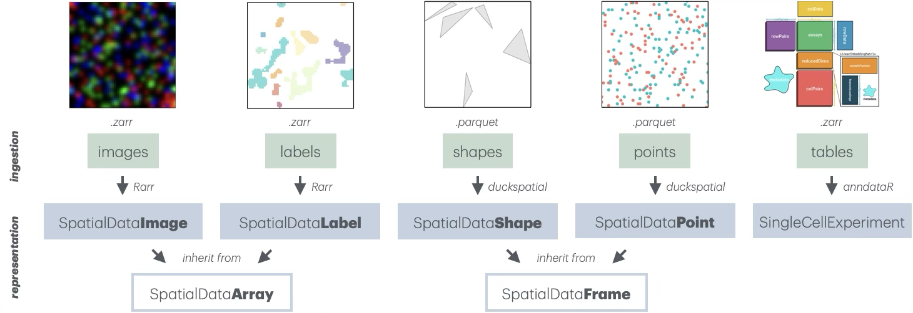
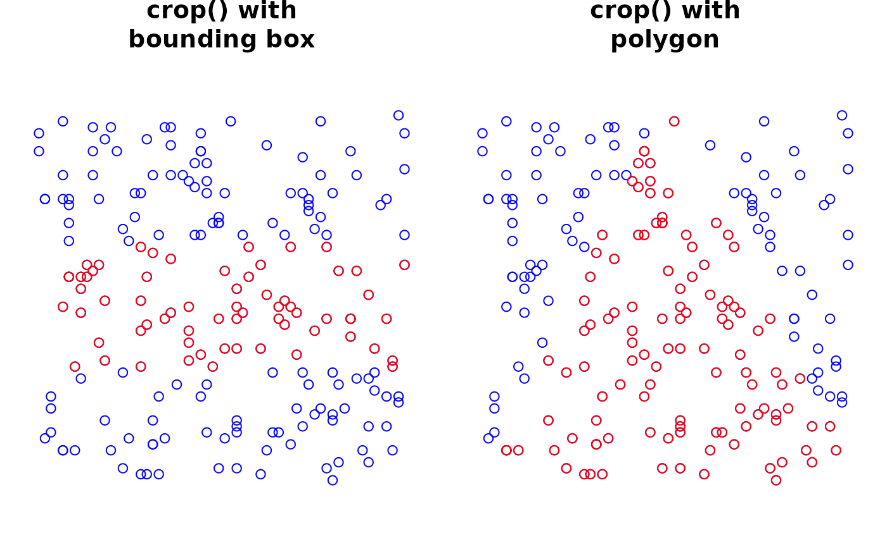

# spatialdataR

## Preamble

### Introduction

The
*[spatialdataR](https://bioconductor.org/packages/3.24/spatialdataR)*
package provides an R interface to Python’s
[spatialdata](https://spatialdata.scverse.org) framework for unified
handling of spatial omics data, including tabular annotations, vector-
and raster-based components. Developed as part of the
[scverse](https://scverse.org) project (Virshup et al. 2023),
`spatialdata` aims to solve the challenges of integrating diverse
spatial datasets – including – by employing the [OME-NGFF (Next
Generation File Format)](https://ngff.openmicroscopy.org) standard
(Marconato et al. 2025).

The Python implementation and core specifications are found at the
[official `spatialdata` website](https://spatialdata.scverse.org).

### Representation

The core data structure is the `SpatialData` class, which organizes data
into 5 coordinated **layers: images, labels, points, shapes, and
tables**. Each layer is stored as a list of layer-specific objects that
carry associated `SpatialDataAttr` (`@meta` slot), which encode
`spatialdata`-specific Zarr attributes (*.zattr* for Zarr v2, and
*zarr.json* for Zarr v3). Together, these layers provide a unified
representation of spatial omics data, combining raster, vector, and
tabular data within a single coherent framework.

**Images/labels** store raster-based data as multi-scale, multi-channel
arrays (e.g., immunofluorescent images or segmentation masks). They are
represented as `SpatialDataImage/Label` objects that, in turn, inherit
from `SpatialDataArray`. These are backed by a list of `ZarrArray`s via
*[Rarr](https://bioconductor.org/packages/3.24/Rarr)* and
*[ZarrArray](https://bioconductor.org/packages/3.24/ZarrArray)*,
enabling chunked, on-disk access.

**Points/shapes** represent spatial coordinates and geometric regions
(e.g., transcript locations or segmentation boundaries). They are
represented as `SpatialDataPoint/Shape` objects that, in turn, inherit
from `SpatialDataFrame.` These are DuckDB-backed by a `duckspatial_df`,
enabling efficient lazy handling.

**Tables** store functional annotations or information that has been
aggregated across layers (e.g., gene $`\times`$ cell data). They are
currently represented as in-memory
*[SingleCellExperiment](https://bioconductor.org/packages/3.24/SingleCellExperiment)*
objects; delayed, Zarr-backed handling of assay data is under active
development.



## Handling

`SpatialData` are represented on-disk as Zarr stores. The package
provides the
[`readSpatialData()`](https://helenalc.github.io/SpatialData/reference/readSpatialData.md)
function to ingest an entire store, although arguments to control which
layers and elements to read or not to read are also available.

For this demonstration, we use a toy dataset included in the package:

``` r

# dependencies
library(spatialdataR)
library(SingleCellExperiment)

# path to 'spatialdata' Zarr store
zs <- file.path("extdata", "blobs.zarr")
zs <- system.file(zs, package="spatialdataR")

# read as 'SpatialData' R object
(sd <- readSpatialData(zs))
```

    ## class: SpatialData
    ## - images(2):
    ##   - blobs_image (3,64,64)
    ##   - blobs_multiscale_image (3,64,64)
    ## - labels(2):
    ##   - blobs_labels (64,64)
    ##   - blobs_multiscale_labels (64,64)
    ## - points(1):
    ##   - blobs_points (200)
    ## - shapes(3):
    ##   - blobs_circles (5,circle)
    ##   - blobs_multipolygons (2,polygon)
    ##   - blobs_polygons (5,polygon)
    ## - tables(1):
    ##   - table (3,10) [blobs_labels]
    ## coordinate systems(5):
    ## - global(8): blobs_image blobs_multiscale_image ... blobs_polygons
    ##   blobs_points
    ## - scale(1): blobs_labels
    ## - translation(1): blobs_labels
    ## - affine(1): blobs_labels
    ## - sequence(1): blobs_labels

The output above summarizes the `SpatialData` object, showing the
dimension of elements in each layer (images, labels, points, shapes,
tables), as well as the defined coordinate systems and which elements
align to each of these.

### Accession

`SpatialData` objects behave like a nested list: the first level
corresponds to layers, and the second level corresponds to elements
within each layers. For convenience, frequently needed accessor
functions are provided as well.

We here demonstrate various equivalent ways of accessing a layer or
element:

``` r

# preferred way
# (using accessor)
image(sd, 1)
image(sd, "blobs_image") 

# alternative ways 
# (using list-style)
images(sd)[[1]]
images(sd)[["blobs_image"]]

sd$images[[1]]
sd$images$blobs_image
sd$images[["blobs_image"]]
```

Similarly, the following are equivalent ways of retrieving element
names:

``` r

# preferred way 
# (using accessor)
imageNames(sd)

# alternative ways 
# (using list-style)
names(sd[[1]])
names(sd$images)
names(sd[["images"]])
```

### Subsetting

Object-wide subsetting of `SpatialData` is supported via `[`, which can
be used to drop layers, or elements within layers. Note that the
following operations are not in-place, but return a `SpatialData` object
with fewer layers/elements:

``` r

# keep image-layer only
sd[1]
sd["images"]

# keep 1st image & label element
sd[c(1, 2), list(1, 1)]
sd[c("images", "labels"), list(1, 1)]
```

### Internals

Every spatial element (tables excluded) is composed of two key slots:

- `data`: a list of `ZarrArray`s for images/labels, or a
  `duckspatial_df` for shapes/points.

- `meta`: a `SpatialDataAttrs` object containing the OME-NGFF metadata
  retrieved from the zarr attributes present in the original Zarr store.

We here demonstrate how to access these slots for a given element

`image` elements represent a special case, as they are stored as a list
of `ZarrArray`s (one per multi-scale resolution). For them,
[`data()`](https://helenalc.github.io/SpatialData/reference/SpatialData.md)
provides an additional argument `k` that specifies which resolution to
retrieve:

- `k=1` retrieves the highest resolution (default).
- `k=Inf` retrieves the lowest resolution available.
- `k=NULL` retrieves the full list of available resolutions.

``` r

# get multi-scale image
i <- image(sd, 2)

a <- data(i, 1)   # highest
b <- data(i, Inf) # lowest

# available resolutions
l <- data(i, NULL)

# dimensions of each
d <- vapply(l, dim, integer(3))
rownames(d) <- c("c", "y", "x")
colnames(d) <- seq_along(l)
show(d)
```

    ##    1  2  3
    ## c  3  3  3
    ## y 64 32 16
    ## x 64 32 16

## Annotations

For single-cell and spatial omics datasets, functional annotations are
commonly stored as [AnnData](https://anndata.readthedocs.io) objects in
Python. In R, we use
*[anndataR](https://bioconductor.org/packages/3.24/anndataR)* (Deconinck
et al. 2025) to read these Zarr-backed `AnnData` as
*[SingleCellExperiment](https://bioconductor.org/packages/3.24/SingleCellExperiment)*(s).

A `table` can link to one or more `label` or `shape` (but not other
layers), whereby internal metadata (`spatialdata_attrs`) are used to
keep track of the element(s) and observations being annotated. This is
handled internally so the user needn’t worry about it; however, we show
it here for didactic purposes:

``` r

# access annotation
(se <- table(sd))
```

    ## class: SingleCellExperiment 
    ## dim: 3 10 
    ## metadata(0):
    ## assays(1): X
    ## rownames(3): channel_0_sum channel_1_sum channel_2_sum
    ## rowData names(0):
    ## colnames(10): 3 4 ... 15 16
    ## colData names(0):
    ## reducedDimNames(0):
    ## mainExpName: NULL
    ## altExpNames(0):

``` r

# annotated region(s)
region(se)
```

    ## [1] "blobs_labels"

``` r

# annotated instance(s)
instances(se)
```

    ##  [1]  3  4  5  8 10 11 12 13 15 16

## Transformations

A key feature of the `SpatialData` framework is its handling of
different coordinate systems. Each element can exist in multiple
coordinate spaces simultaneously, defined by transformations in its
on-disk Zarr attributes.

The relationships between different elements and their respective
coordinate spaces can be complex. `SpatialData` provides the
[`CTgraph()`](https://helenalc.github.io/SpatialData/reference/CTgraph.md)
and
[`CTplot()`](https://helenalc.github.io/SpatialData/reference/CTgraph.md)
functions to construct and visualize a directed graph of these
relationships:

- **source nodes** (prefixed with `_`) represent individual elements.
- **target nodes** represent the coordinate systems (e.g., `global`).
- **edges** represent the transformations required to align an element.

``` r

g <- CTgraph(sd)
CTplot(g)
```


The
[`transform()`](https://helenalc.github.io/SpatialData/reference/trans.md)
function resolves the necessary steps to project an element into a
target coordinate system by traversing this graph, and applying the
respective transformation(s). Under the hood, this involves:

1.  Retrieving the relevant transformation data from the element’s
    `SpatialDataAttr` (e.g., scale factors for x- and y-coordinates);
    and,

2.  Applying the appropriate transformation function(s) in the correct
    order (e.g.,
    [`scale()`](https://helenalc.github.io/SpatialData/reference/trans.md)
    then
    [`translation()`](https://helenalc.github.io/SpatialData/reference/trans.md)).

``` r

# get element 
a <- label(sd)

# project into 'global'
b <- spatialdataR::transform(a, "scale")

# compare XY extents
do.call(rbind, c(a=extent(a), b=extent(b)))
```

    ##     [,1] [,2]
    ## a.x    0   64
    ## a.y    0   64
    ## b.x    0  128
    ## b.y    0  192

## Utilities

### Cropping

[`crop()`](https://helenalc.github.io/SpatialData/reference/crop.md) may
be used to subset elements – across all layers – according to a
*spatial* bounding box or polygon. This region may be supplied in
different ways, including as a `SpatialDataShape`. In addition, the
following are okay:

- For bounding box cropping, an
  [`sf::st_bbox()`](https://r-spatial.github.io/sf/reference/st_bbox.html)
  object, or a list of `xmin/xmax/ymin/ymax` values (order irrelevant).

- For polygon cropping, an
  [`sf::st_polygon()`](https://r-spatial.github.io/sf/reference/st.html)
  or [`sf::st_sfc()`](https://r-spatial.github.io/sf/reference/sfc.html)
  object, or a two-column matrix of XY coordinates (at least 3 rows =
  triangle).

``` r

# bounding box
xy <- list(xmin=-Inf, xmax=Inf, ymin=20, ymax=40)
sp <- crop(sd, xy)

plot(
    point(sd)$geometry, col="blue", 
    main="crop() with\nbounding box") 
points(point(sp)$geometry, col="red") 

# polygon
xy <- rbind(c(0, 0), c(64, 0), c(32, 64))
sq <- crop(sd, xy)

plot(
    point(sd)$geometry, col="blue", 
    main="crop() with\npolygon") 
points(point(sq)$geometry, col="red") 
```



### Masking

[`mask()`](https://helenalc.github.io/SpatialData/reference/mask.md)
aggregates data between elements and across layers, with support for
masking of points by images by labels, points by shapes, and shapes by
shapes:

- **point by shape** masking counts the number of points that fall
  within each shape (e.g., counting transcripts in cell membrane or
  nucleus segmentation boundaries in order to obtain a gene $`\times`$
  cell-level data).

- **image by label** masking aggregates channel-wise pixel values in an
  image according to the regions defined by a label (e.g., obtaining
  mean fluorescence intensities per cell).

- **shape by shape** masking aggregates the data in a table of one shape
  by another shape (e.g., summarizing cell-level data into regions of
  interest).

A couple considerations are also worth mentioning:

- The identifier of the resulting `table` may be specified via `name`,
  which will default to `i_by_j` when masking element `i` by element
  `j`.

- Instances of `i` that do not map to any instances of `j` (e.g.,
  unassigned transcripts) will be assigned to a special “0” column in
  the resulting table.

``` r

# average channel-wise pixel values by labels
sp <- mask(sd, i="blobs_image", j="blobs_labels")
se <- table(sp, "blobs_image_by_blobs_labels")
assay(se)
```

    ## 3 x 10 sparse Matrix of class "dgCMatrix"

    ##                                                                            
    ## 0 0.1325593 0.11240838 0.05495268 0.13883753 0.1759411 0.05216844 0.1574298
    ## 1 0.1773876 0.08582868 0.07500563 0.14309153 0.1848081 0.18733438 0.1321635
    ## 2 0.1171959 0.13570302 0.18691482 0.06592828 0.1295153 0.03637876 0.1985580
    ##                                      
    ## 0 0.0225221691 0.134730899 0.10671244
    ## 1 0.2252634943 0.071093576 0.07564495
    ## 2 0.0002233054 0.006969089 0.09928612

``` r

# count different point species in polygons
sp <- mask(sd, i="blobs_points", j="blobs_polygons")
se <- table(sp, "blobs_points_by_blobs_polygons")
assay(se)
```

    ## 2 x 6 sparse Matrix of class "dgCMatrix"
    ##          0 1 2 3 4 5
    ## gene_a  87 . . 1 2 .
    ## gene_b 105 2 . 1 . 2

``` r

# average shape-level data by other shapes
sp <- mask(sd, i="blobs_polygons", j="blobs_circles")
```

### Querying

[`query()`](https://helenalc.github.io/SpatialData/reference/query.md)
filters elements across all layers based on `table` metadata in
`dplyr`-style syntax, where queries may be passed via the ellipsis
(`...`):

TODO

### Combining

[`combine()`](https://helenalc.github.io/SpatialData/reference/combine.md)
can be used to merge two `SpatialData` objects into one (or many, via
`do.call(list(...), combine)`). Here, elements names will be made unique
across objects via
[`make.names()`](https://rdrr.io/r/base/make.names.html), appending a
suffix to the element names of subsequent objects. Alternatively, names
could be customize before combining.

``` r

sp <- combine(list(foo=sd, bar=sd))
cbind(
    original=lengths(colnames(sd)),
    combined=lengths(colnames(sp)))
```

    ##        original combined
    ## images        2        4
    ## labels        2        4
    ## points        1        2
    ## shapes        3        6
    ## tables        1        2

``` r

imageNames(sp)
```

    ## [1] "foo.blobs_image"            "foo.blobs_multiscale_image"
    ## [3] "bar.blobs_image"            "bar.blobs_multiscale_image"

### Coordinates

[`centroids()`](https://helenalc.github.io/SpatialData/reference/centroids.md)
may be used to extract spatial coordinates for every instance in a given
element. This applies all layers except images and tables. Notably, for
labels and shapes, the centroids of each region are returned (center of
mass).

``` r

head(centroids(point(sd)))
```

    ##    x  y  genes
    ## 1  6 48 gene_b
    ## 2 41 28 gene_b
    ## 3 27 54 gene_b
    ## 4  6 44 gene_a
    ## 5 13  6 gene_b
    ## 6 33 61 gene_b

[`extent()`](https://helenalc.github.io/SpatialData/reference/extent.md)
will obtain the range of an element’s spatial coordinates in a target
coordinate space. This can be done for one element, or object-wide in
order to obtain the largest extent across all elements in an object.

``` r

# object-wide
xy <- extent(sd)
unlist(xy)
```

    ## x1 x2 y1 y2 
    ##  0 64  0 64

``` r

# one element
xy <- extent(point(sd))
unlist(xy)
```

    ## x1 x2 y1 y2 
    ##  1 62  1 62

``` r

# with prior alignment to target coordinate space
xy <- extent(label(sd))
yx <- extent(label(sd), "scale")
rbind(native=unlist(xy), scaled=unlist(yx))
```

    ##        x1  x2 y1  y2
    ## native  0  64  0  64
    ## scaled  0 128  0 192

## Appendix

### Resources

- [SpatialData.plot](https://github.com/HelenaLC/SpatialData.plot):
  companion package with `ggplot`-based visualization capabilities,
  including layered plotting of different elements with control over
  each’s aesthetics, channel-mixing and auto-contrasting for images,
  transformations handling, etc.

- [SpatialData.data](https://github.com/HelenaLC/SpatialData.data):
  companion package with example datasets from different platforms,
  including use of
  *[BiocFileCache](https://bioconductor.org/packages/3.24/BiocFileCache)*
  for efficient data management.

- [SpatialData.demo](https://github.com/HelenaLC/SpatialData.demo):
  companion repository with vignettes on analyzing datasets from
  different platforms, including transcriptomics and proteomics.

### Session info

``` r

sessionInfo()
```

    ## R Under development (unstable) (2026-06-05 r90111)
    ## Platform: x86_64-pc-linux-gnu
    ## Running under: Ubuntu 24.04.4 LTS
    ## 
    ## Matrix products: default
    ## BLAS:   /usr/lib/x86_64-linux-gnu/openblas-pthread/libblas.so.3 
    ## LAPACK: /usr/lib/x86_64-linux-gnu/openblas-pthread/libopenblasp-r0.3.26.so;  LAPACK version 3.12.0
    ## 
    ## locale:
    ##  [1] LC_CTYPE=C.UTF-8       LC_NUMERIC=C           LC_TIME=C.UTF-8       
    ##  [4] LC_COLLATE=C.UTF-8     LC_MONETARY=C.UTF-8    LC_MESSAGES=C.UTF-8   
    ##  [7] LC_PAPER=C.UTF-8       LC_NAME=C              LC_ADDRESS=C          
    ## [10] LC_TELEPHONE=C         LC_MEASUREMENT=C.UTF-8 LC_IDENTIFICATION=C   
    ## 
    ## time zone: UTC
    ## tzcode source: system (glibc)
    ## 
    ## attached base packages:
    ## [1] stats4    stats     graphics  grDevices utils     datasets  methods  
    ## [8] base     
    ## 
    ## other attached packages:
    ##  [1] SingleCellExperiment_1.35.1 SummarizedExperiment_1.43.0
    ##  [3] Biobase_2.73.1              GenomicRanges_1.65.0       
    ##  [5] Seqinfo_1.3.0               IRanges_2.47.2             
    ##  [7] S4Vectors_0.51.3            BiocGenerics_0.59.7        
    ##  [9] generics_0.1.4              MatrixGenerics_1.25.0      
    ## [11] matrixStats_1.5.0           spatialdataR_0.99.43       
    ## [13] BiocStyle_2.41.0           
    ## 
    ## loaded via a namespace (and not attached):
    ##  [1] tidyselect_1.2.1    grumpy_0.1.1        blob_1.3.0         
    ##  [4] dplyr_1.2.1         R.utils_2.13.0      fastmap_1.2.0      
    ##  [7] duckdb_1.5.2        digest_0.6.39       lifecycle_1.0.5    
    ## [10] sf_1.1-1            paws.storage_0.10.0 magrittr_2.0.5     
    ## [13] compiler_4.7.0      rlang_1.2.0         sass_0.4.10        
    ## [16] tools_4.7.0         yaml_2.3.12         knitr_1.51         
    ## [19] S4Arrays_1.13.0     htmlwidgets_1.6.4   classInt_0.4-11    
    ## [22] curl_7.1.0          reticulate_1.46.0   DelayedArray_0.39.3
    ## [25] abind_1.4-8         KernSmooth_2.23-26  withr_3.0.2        
    ## [28] purrr_1.2.2         desc_1.4.3          R.oo_1.27.1        
    ## [31] grid_4.7.0          e1071_1.7-17        cli_3.6.6          
    ## [34] rmarkdown_2.31      crayon_1.5.3        ragg_1.5.2         
    ## [37] otel_0.2.0          DBI_1.3.0           cachem_1.1.0       
    ## [40] proxy_0.4-29        BiocManager_1.30.27 XVector_0.53.0     
    ## [43] vctrs_0.7.3         Matrix_1.7-5        jsonlite_2.0.0     
    ## [46] bookdown_0.46       RBGL_1.89.0         Rgraphviz_2.57.0   
    ## [49] systemfonts_1.3.2   jquerylib_0.1.4     units_1.0-1        
    ## [52] glue_1.8.1          pkgdown_2.2.0       ZarrArray_1.1.0    
    ## [55] Rarr_2.1.17         tibble_3.3.1        pillar_1.11.1      
    ## [58] rappdirs_0.3.4      htmltools_0.5.9     graph_1.91.0       
    ## [61] R6_2.6.1            dbplyr_2.5.2        httr2_1.2.2        
    ## [64] wk_0.9.5            textshaping_1.0.5   evaluate_1.0.5     
    ## [67] lattice_0.22-9      R.methodsS3_1.8.2   png_0.1-9          
    ## [70] duckspatial_1.1.1   paws.common_0.8.9   bslib_0.11.0       
    ## [73] class_7.3-23        Rcpp_1.1.1-1.1      uuid_1.2-2         
    ## [76] SparseArray_1.13.2  anndataR_1.3.0      xfun_0.58          
    ## [79] fs_2.1.0            pkgconfig_2.0.3

### References

Deconinck, Louise, Luke Zappia, Robrecht Cannoodt, et al. 2025.
“anndataR improves interoperability between R and Python in single-cell
transcriptomics.” *bioRxiv*, 2025.08.18.669052.
<https://doi.org/10.1101/2025.08.18.669052>.

Marconato, Luca, Giovanni Palla, Kevin A Yamauchi, et al. 2025.
“SpatialData: an open and universal data framework for spatial omics.”
*Nature Methods* 22 (1): 58–62.
<https://doi.org/10.1038/s41592-024-02212-x>.

Virshup, Isaac, Danila Bredikhin, Lukas Heumos, et al. 2023. “The
scverse project provides a computational ecosystem for single-cell omics
data analysis.” *Nature Biotechnology* 41 (5): 604–6.
<https://doi.org/10.1038/s41587-023-01733-8>.
